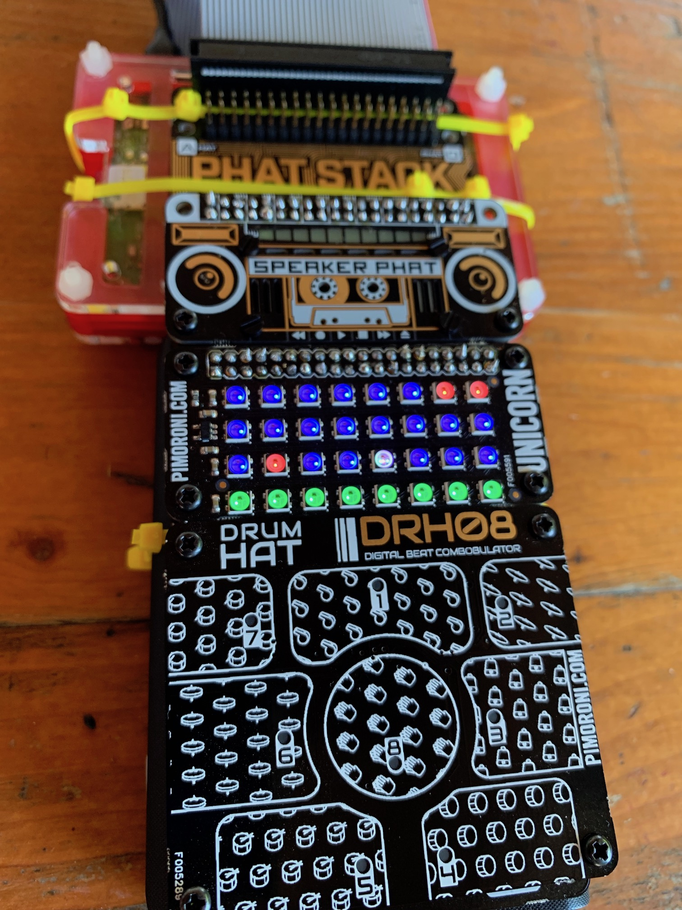
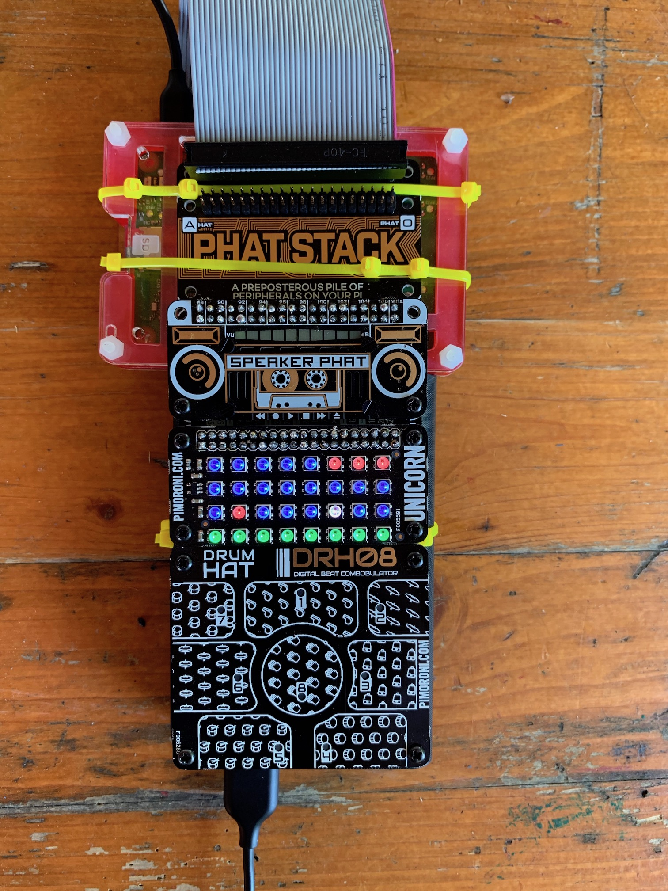
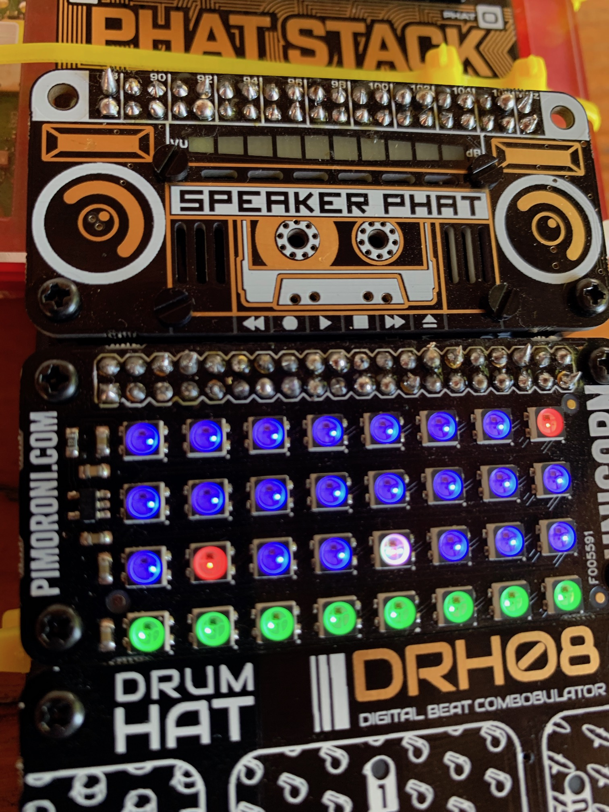
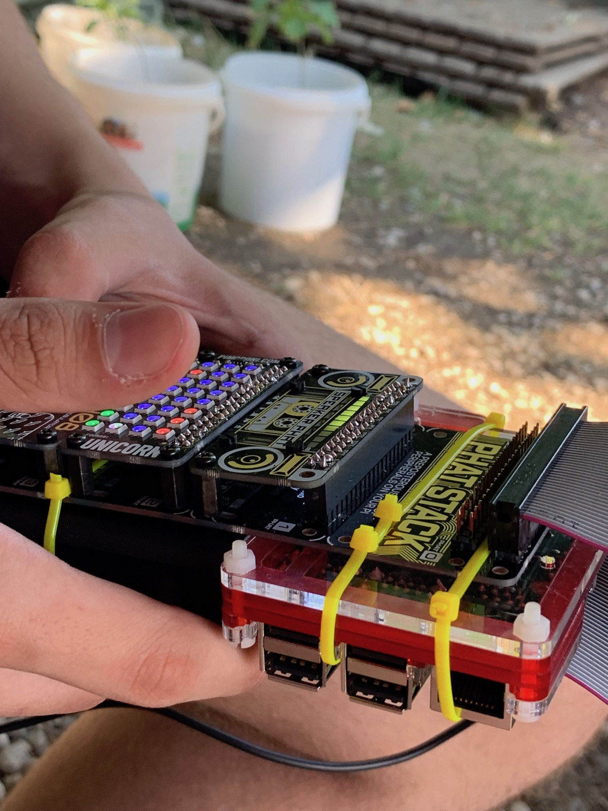

# phatboy

Simple Python jump'n'run game for Pimoroni Unicorn HAT running on Raspberry Pi. 
Four eleventh-graders built the game and a day and a half without prior knowledge :) 






## Hardware 

We used a [pHAT Stack](https://shop.pimoroni.com/products/phat-stack?variant=658973392906) to connect the following boards to a Raspberry Pi 3 (every version should work): 

- [Unicorn pHAT](https://shop.pimoroni.com/products/unicorn-phat) 4*8 LED Matrix
- [Speaker pHAT](https://shop.pimoroni.com/products/speaker-phat) Simple speaker 
- [DrumHat](https://shop.pimoroni.com/products/drum-hat) 8 capacitive touch pads 

## Software

You need to install all required libraries from Pimoroni:

- https://github.com/pimoroni/unicorn-hat 
- https://github.com/pimoroni/drum-hat
- https://github.com/pimoroni/speaker-phat

Or simply: 

```
curl -sS https://get.pimoroni.com/unicornhat | bash
curl https://get.pimoroni.com/drumhat | bash
curl -sS https://get.pimoroni.com/speakerphat | bash
```

Also make sure to enable I2C via `raspi-config`. 

## Install the game

- `git clone git@github.com:meaku/phatboy.git`
- `cd phatbox`
- `sudo python game.py` 

If you want to keep it running in the background, use `sudo python game.py &`

## Caveats 

Unicorn pHAT and Speaker pHAT are using the same ports to control LEDs / sound. 
This leads to weird sounds whenever the pixels are updated. In our case we liked the effect and weird sound :) 

